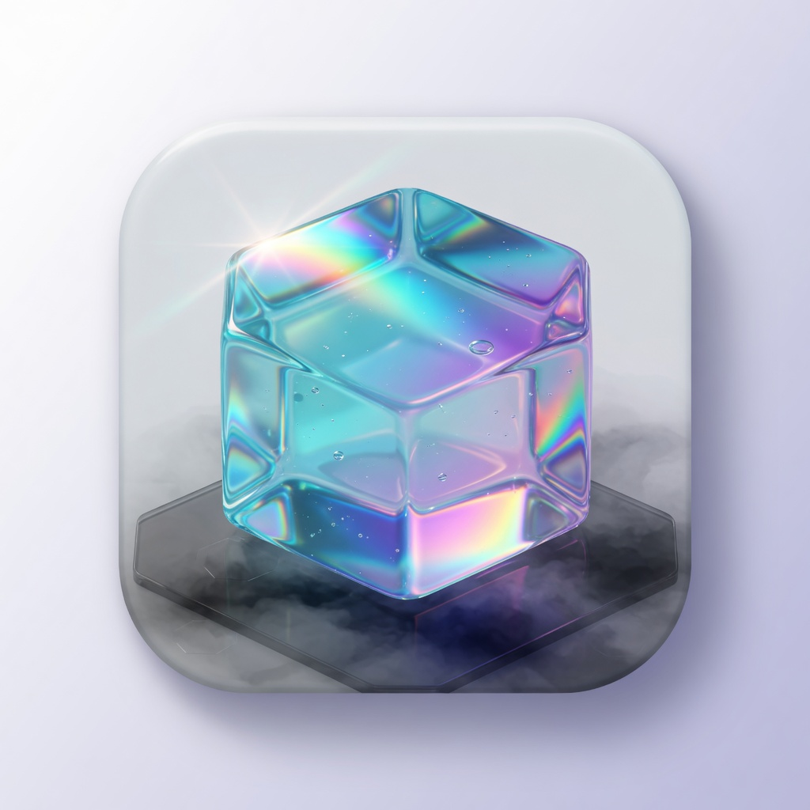

<p align="center">
  
</p>

<h1 align="center">Lumina</h1>

<p align="center">
  A local, encrypted 2FA authenticator for Windows.
</p>

<p align="center">
  
  
  
</p>

Lumina generates one-time codes on your machine. The vault is encrypted at rest with a PIN (scrypt + AES-256-GCM). Nothing is uploaded. There is no account and no cloud sync.

This is an independent open-source project. It is not affiliated with Google Authenticator, Authy, or any of the services whose logos appear in the UI.

## Features

- TOTP (SHA1 / SHA256 / SHA512), HOTP, and Steam Guard
- Click a code to copy it, with a next-code preview
- Add by secret, `otpauth://` URI, QR image, or scan a QR from the screen
- Import Aegis, 2FAS, Bitwarden, Google Authenticator migration payloads, and URI lists
- Encrypted JSON export, otpauth URI export, and local backups
- PIN lock, auto-lock, and lock on Windows session lock
- Always-on-top companion window and system tray
- Liquid-glass UI (Windows 11 acrylic when available)
- Brand marks for common issuers

## Security model

- Secrets stay in the Electron **main** process. The renderer only receives rotating codes.
- Vault file: `%APPDATA%\Lumina\vault.json` (installer), or `LuminaData\vault.json` next to the portable exe. Encrypted with scrypt + AES-256-GCM.
- Clipboard can auto-clear after a code is copied.
- Exporting without a password writes secrets in plaintext. Only do that onto media you control.
- Builds on GitHub Actions are **unsigned**. Windows SmartScreen will likely warn until you sign releases yourself.

Lumina has not had a third-party security audit. Read [SECURITY.md](SECURITY.md) before storing high-value accounts in it.

## Install

Grab a build from [Releases](../../releases). If SmartScreen appears, choose **More info → Run anyway** (builds are unsigned).

| File | What it is |
| --- | --- |
| `Lumina-1.0.0-win-x64-setup.exe` | Windows installer. Wizard, Start Menu + desktop shortcuts, uninstalls from Settings. Vault lives in `%APPDATA%\Lumina`. |
| `Lumina-1.0.0-win-x64-portable.exe` | No setup. Double-click to run. Vault lives in `LuminaData\` next to the exe — copy that folder with the exe if you move it. |

## Build from source

Requires [Node.js 20+](https://nodejs.org/) (22 recommended).

```bash
git clone https://github.com/neuroxil/Lumina.git
cd lumina
npm install
npm test
npm run dev
```

| Script | What it does |
| --- | --- |
| `npm run dev` | Start Electron in development |
| `npm test` | Run unit tests (RFC 6238 vectors, importers) |
| `npm run typecheck` | TypeScript check for main and renderer |
| `npm run build` | Compile main, preload, and renderer |
| `npm run package` | Windows NSIS installer + portable exe in `dist/` |
| `npm run package:portable` | Portable exe only |

## Project layout

```
lumina/
├── src/
│   ├── main/          Electron main process, vault, crypto, tray
│   ├── preload/       contextBridge API
│   ├── renderer/      React UI
│   └── shared/        OTP, otpauth, importers (also unit-tested)
├── build/             App icon
├── .github/workflows  CI and tagged releases
└── dist/              Packaged Windows builds (not in git)
```

## Releasing

CI runs tests and typecheck on every push and pull request.

A GitHub Release is created when you push a version tag:

```bash
git tag v1.0.0
git push origin v1.0.0
```

The [release workflow](.github/workflows/release.yml) builds unsigned Windows artifacts and attaches them to the tag.

## Contributing

Bug reports, design polish, and importer coverage are welcome. See [CONTRIBUTING.md](CONTRIBUTING.md).

## License

[MIT](LICENSE)
